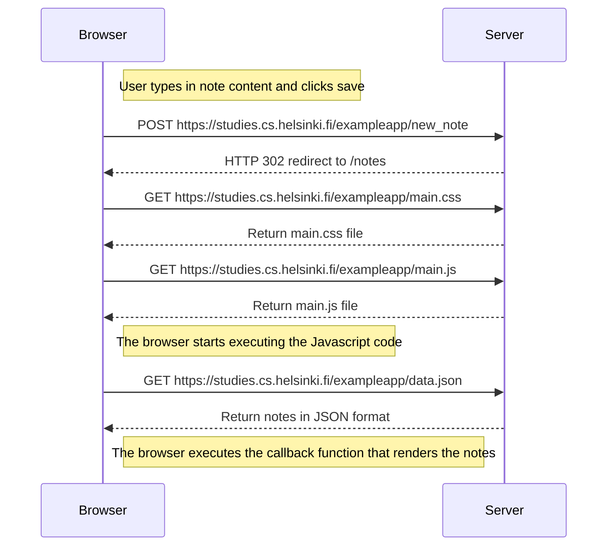

```mermaid
sequenceDiagram
      participant Browser
      participant Server
      Note right of Browser: User types in note content and clicks save
      Browser->>Server: POST https://studies.cs.helsinki.fi/exampleapp/new_note
      Server-->>Browser: HTTP 302 redirect to /notes

      Browser->>Server: GET https://studies.cs.helsinki.fi/exampleapp/main.css
      Server-->>Browser: Return main.css file

      Browser->>Server: GET https://studies.cs.helsinki.fi/exampleapp/main.js
      Server-->>Browser: Return main.js file
      Note right of Browser: The browser starts executing the Javascript code
      Browser->>Server: GET https://studies.cs.helsinki.fi/exampleapp/data.json
      Server-->>Browser: Return notes in JSON format
      Note right of Browser: The browser executes the callback function that renders the notes
```
