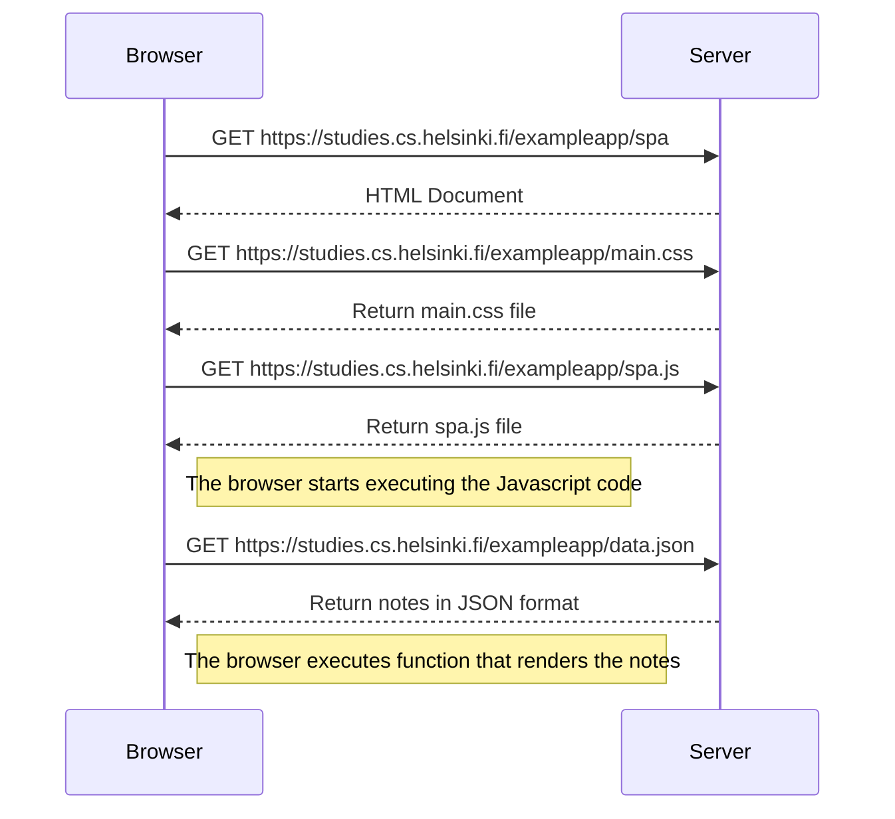

```mermaid
  sequenceDiagram
      participant Browser
      participant Server

      Browser->>Server: GET https://studies.cs.helsinki.fi/exampleapp/spa
      Server-->>Browser: HTML Document

      Browser->>Server: GET https://studies.cs.helsinki.fi/exampleapp/main.css
      Server-->>Browser: Return main.css file

      Browser->>Server: GET https://studies.cs.helsinki.fi/exampleapp/spa.js
      Server-->>Browser: Return spa.js file
      Note right of Browser: The browser starts executing the Javascript code
      Browser->>Server: GET https://studies.cs.helsinki.fi/exampleapp/data.json
      Server-->>Browser: Return notes in JSON format
      Note right of Browser: The browser executes function that renders the notes
```
