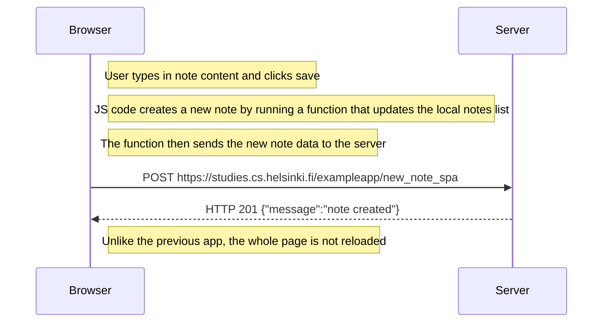

```mermaid
  sequenceDiagram
      participant Browser
      participant Server
      Note right of Browser: User types in note content and clicks save
      Note right of Browser: JS code creates a new note by running a function that updates the local notes list
      Note right of Browser: The function then sends the new note data to the server
      Browser->>Server: POST https://studies.cs.helsinki.fi/exampleapp/new_note_spa
      Server-->>Browser: HTTP 201 {"message":"note created"}
      Note right of Browser: Unlike the previous app, the whole page is not reloaded
```
